# PostU

This is a micro-posting application that emulates Tweeter. It is made in Ruby on Rails 7 and uses other technologies such as HTML, CSS, JavaScript and PostgreSQL.</br>
You can view the app in the following link: https://postu-app.herokuapp.com/.</br>
The app is deployed in Heroku but due to depoyment costs the link might not be able at the time you are reading it. In any case there is an App walkthrough down if the link is not available when you check it.

## Getting started

To get started with the app, clone the repo and then install the needed gems:

```
$ gem install bundler -v 2.3.14
$ bundle _2.3.14_ config set --local without 'production'
$ bundle _2.3.14_ install
```

Next, migrate the database:

```
$ rails db:migrate
```

Finally, run the test suite to verify that everything is working correctly:

```
$ rails test
```

If the test suite passes, you'll be ready to run the app in a local server:

```
$ rails server
```

## App Walkthrough

1) The first thing you will se is the home page where you can visit the static pages on
the header and on the footer (help, about,contact), sign up and log in.


2) When you click on "Sign up", you will be taken to the "Create an account" page.

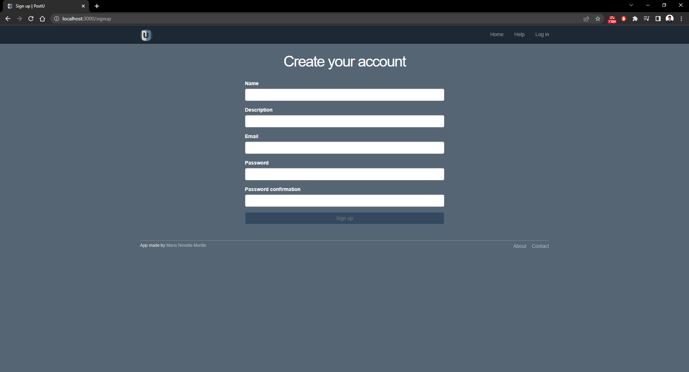

3) When you click on the "Sign up" button you will receive an email like the one below:

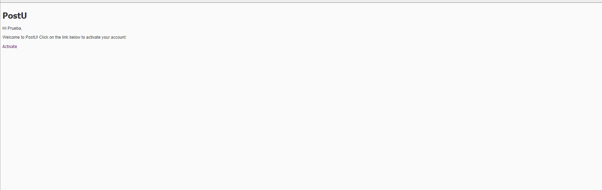

Once you click on "Activate", you will be redirected to your profile page:

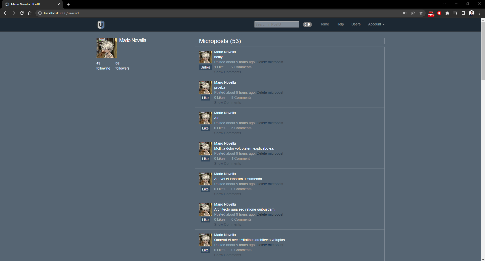

4) You can Log in through the Home page.

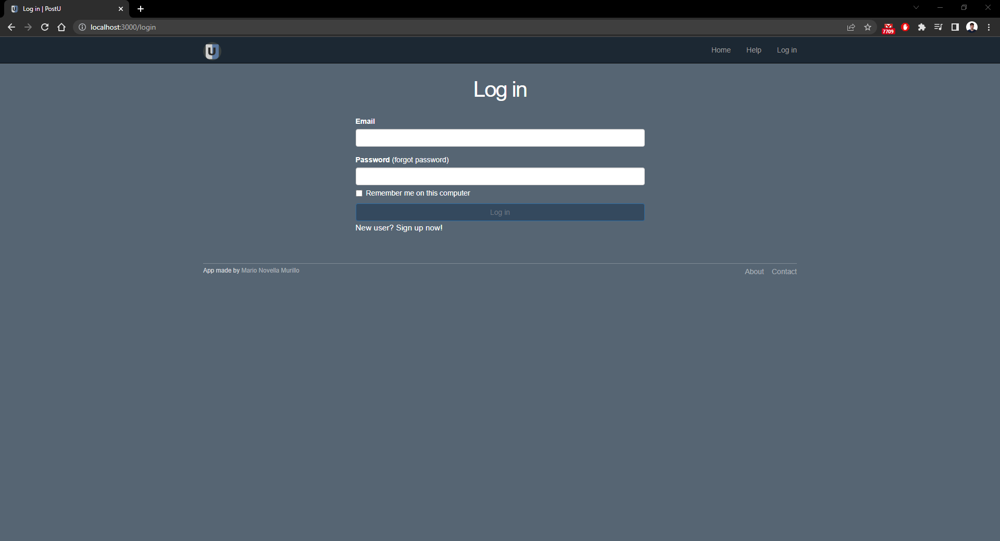

Here you can also reset your password in case you forgot it, you just have to
enter your email

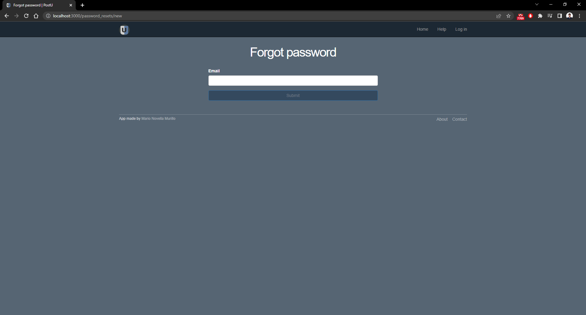

and you will recive an email with a link to change your password.

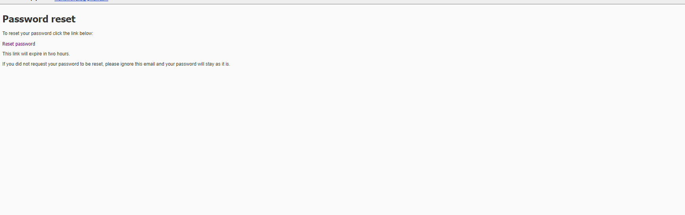

Please note that clicking the "Remember me on this computer" checkbox will store your credentials
so that you don't have to type them in again until you log out.

5) This is the main page of the application. Here you can see your feed with your microposts
and those of the users you follow. You have a text field where you can create your own microposts and
a button to attach an image to your micropost.


In the microposts you can like/dislike, delete them in case you have written them yourself and you have a link to
view the micropost and comment on it or view all comments on those micro-post.

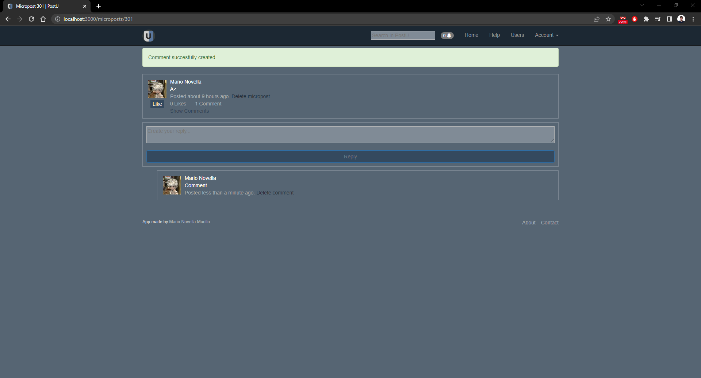

You will recive a notification when a user comments one of your microposts.

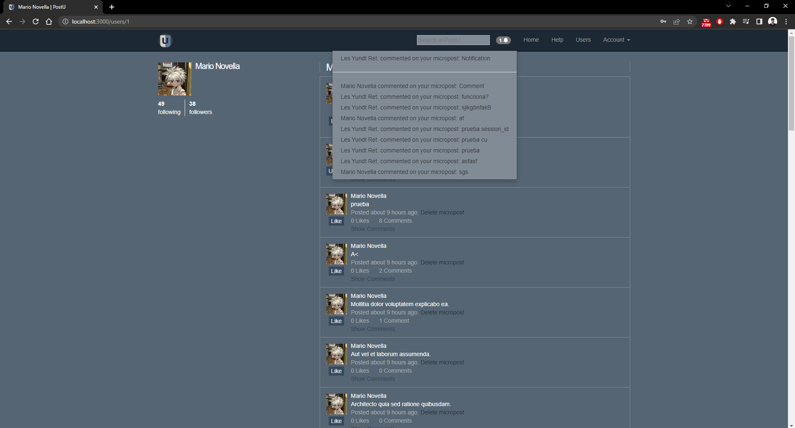

6) Clicking the "Users" button on the navbar will show you all the users of the app.

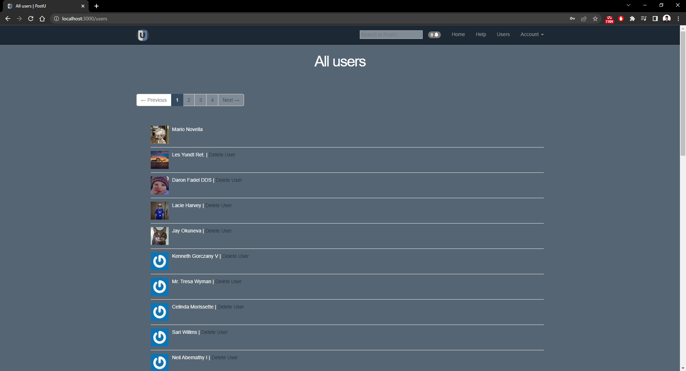

7) You also have a Search Bar in the navbar where you can search microposts by user or by the content of the micropost.


You can even sort the results alphabetically by user name, by content or by time of publication.

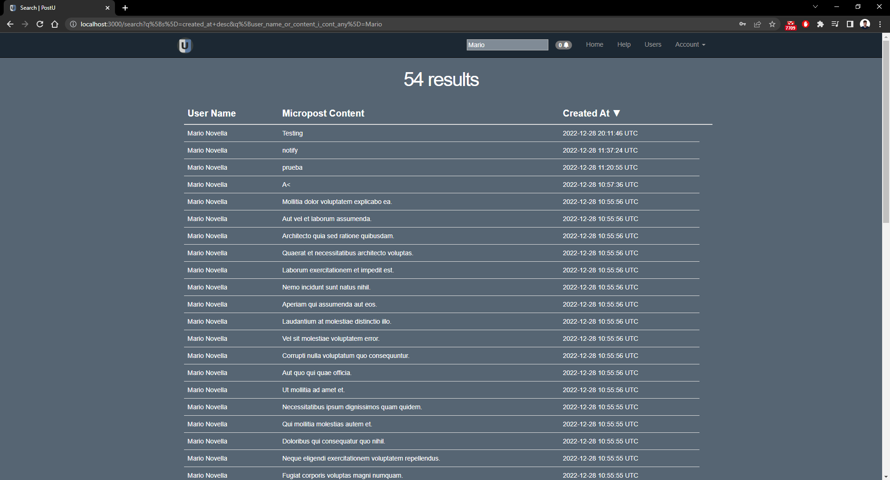

8) When you click on the "Account" button, a menu of options will appear in which you can view your profile,
modify it or log out.

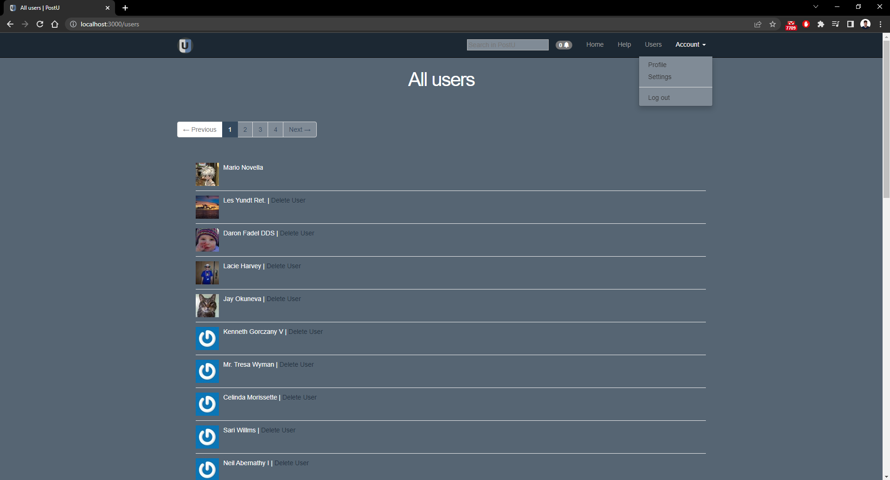

This is the options you have to edit your profile, you can even add a description:

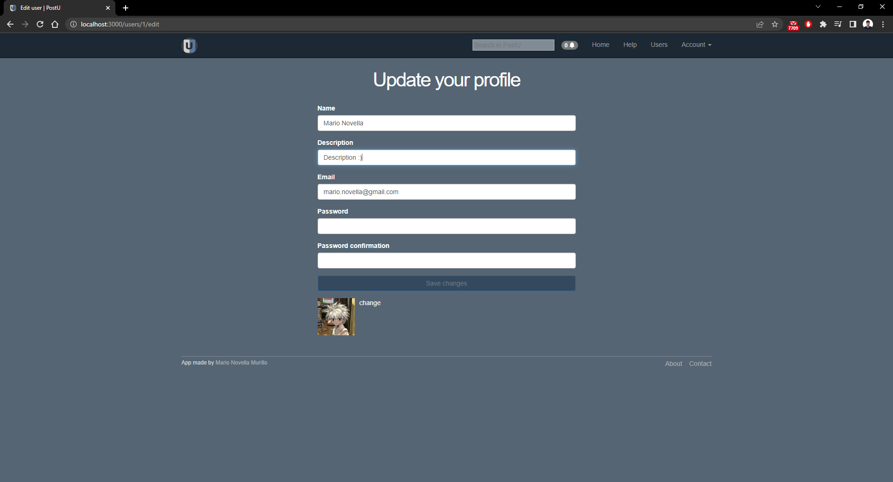

remote_theme: pages-themes/midnight@v0.2.0
