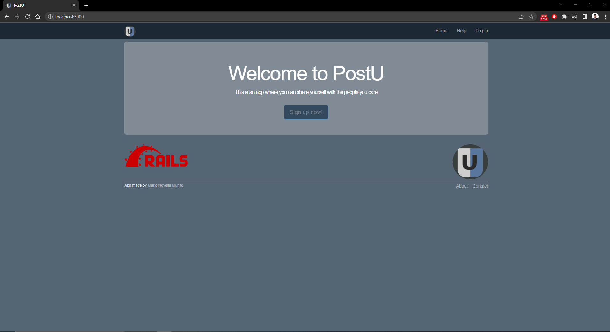
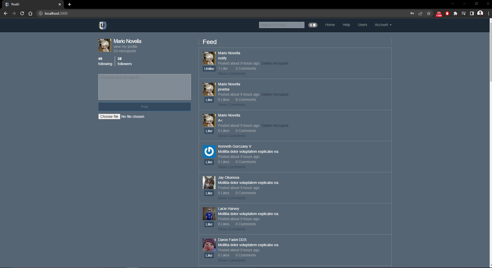

# PostU

This is a micro-posting application that emulates Tweeter. It is made in Ruby on Rails 7 and uses other technologies such as HTML, CSS, JavaScript and PostgreSQL.
You can view the app in the following link: https://postu-app.herokuapp.com/.
The app is deployed in Heroku but due to depoyment costs the link might not be able in the time you are reading it. In any case there is an App walkthrough down if the link is not available when you check it.

## Getting started

To get started with the app, clone the repo and then install the needed gems:

```
$ gem install bundler -v 2.3.14
$ bundle _2.3.14_ config set --local without 'production'
$ bundle _2.3.14_ install
```

Next, migrate the database:

```
$ rails db:migrate
```

Finally, run the test suite to verify that everything is working correctly:

```
$ rails test
```

If the test suite passes, you'll be ready to run the app in a local server:

```
$ rails server
```

## App Walkthrough

1) The first thing you will se is the home page where you can visit the static pages on
the header and on the footer (help, about,contact), sign up, and log in.



2) Clicking on signu up will take you to the 'Create your account' page.


3) By clicking on the Sign up button you will recive an email as the following:


Once you click on Activate you will be redirected to your profile page:


4) You can Log in through the Home page.


Here you can also reset your password in case you forgot it, you just have to.
enter your email


and you will recive an email with a link to change your password.


Note that clicking on the 'Remember me on this computer box' will store your credential
so you don't need to write them again until you log out.

5) This is the Main page of the app. Here you can see your feed with your micropost
and those of the users you follow. You have a text field where you can create your own micropost and
an image attach button to attach an image to your micropost.



In the micropost you can like/unlike them, delete them in case you wrote them and you have a link to
see the micropost and comment it or see all the comments of these micropost.


You will recive a notification when a user comments one of your microposts.


6) Clicking the 'Users' button on the navbar will show you all the users of the app.


7) You also have a Search Bar in the navbar where you can search microposts by user or the content of the micropost.


You can even order the results alphabeticaly by the user's name or by the content or by published time.


8) Clicking on the 'Account' button will bring up a menu of options where you can view your profile,
make changes to it or log out.


This is the options you have to edit your profile, you can even add a description:


